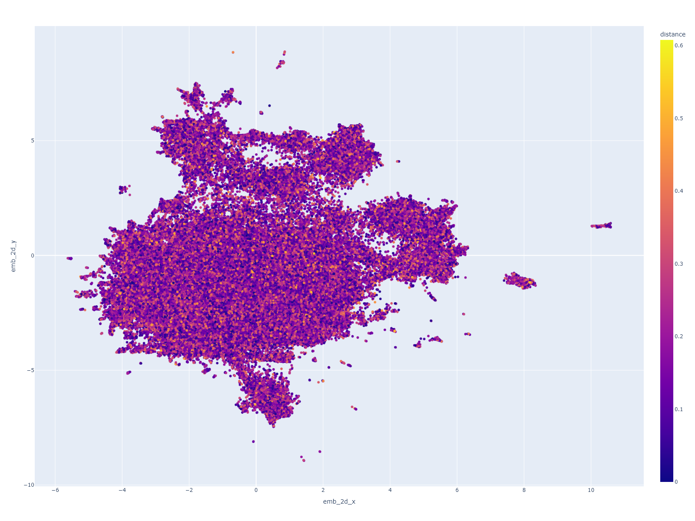
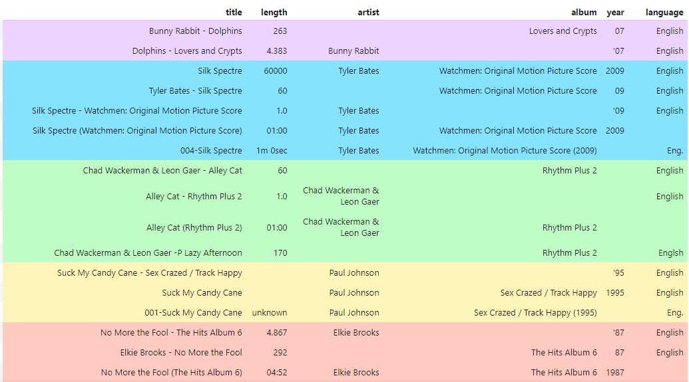
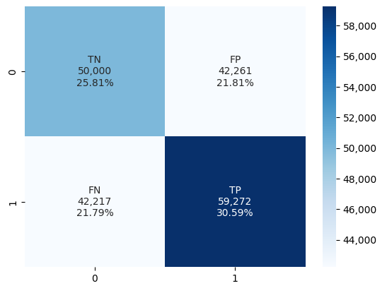
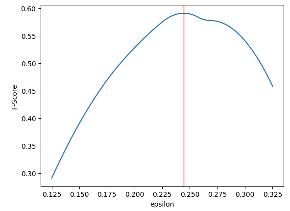

# Duplicate Detection with GenAI

Resources and notebooks to accompany the 'Duplicate Detection with GenAI' paper available [here](https://arxiv.org/abs/2406.15483).

## Musicbrainz Datasets
The examples here use the publicly available Musicbrainz 200K dataset. This can
be seen at the Liepzig University benchmark datasets for entity resolution [webpage](https://dbs.uni-leipzig.de/research/projects/benchmark-datasets-for-entity-resolution).

The actual dataset itself can be downloaded using the following links:

- Musicbrainz 200K dataset: [musicbrainz-200-A01.csv](https://dbs.uni-leipzig.de/files/datasets/saeedi/musicbrainz-200-A01.csv.dapo)

## Requirements

You will need to install the packages listed in the [requirements.txt](requirements.txt) file in order to run the
example notebooks. You will also need to install the **FAISS** package. If you're using conda then you can
do it like this:

To install the GPU version:
```bash
conda install -c conda-forge faiss-gpu
```

To install the CPU version:
```bash
conda install -c conda-forge faiss-cpu
```

## Example Notebooks
There are a number of notebooks that cover the following things:

- Steps of the proposed method
- Visualisation of embeddings
- Visualisation of match groups
- Evaluate results of experiments
- Show results of experiments

The steps that are involved in the proposed method consist of the following steps:

1. Create Embedding Vectors using "Match Sentences"
2. Create Faiss Index and identify potential duplicate candidate cluster groups

### Step 1. Create Embedding Vectors using Match Sentences

This is in the following notebook:

- Create embeddings for Musicbrainz 200K dataset: [create_embeddings_200k.ipynb](create_embeddings_200k.ipynb) 

### Step 2. Create Faiss Index and Clusters

Use the following notebook to create a Faiss Index and identify potential duplicate candidate cluster groups.

- Create Faiss index and do clustering for Musicbrainz 200K dataset: [clustering_200k_with_faiss_index.ipynb](clustering_200k_with_faiss_index.ipynb) 

### Visualise Embeddings

This is in the following notebook:

- Visualise embeddings for Musicbrainz 200K dataset: [visualize_embeddings_musicbrainz_200k.ipynb](visualize_embeddings_musicbrainz_200k.ipynb)



### Visualise Match Groups

Only the match groups for the Musicbrainz 200K dataset are visualised since
that's the dataset that we ran our main experiments with.

- Visualise match groups for the Musicbrainz 200K clustering: [visualize_match_group_results_200k.ipynb](visualize_match_group_results_200k.ipynb)



### Evaluate experimental Results

This is in the following notebook:

- Evaluate results for the Musicbrainz 200K experiments: [evaluate_200k_clustering.ipynb](evaluate_200k_clustering.ipynb)



### Show experimental Results

This is in the following notebook:

- Show experiment results for the Musicbrainz 200K experiments: [experimental_results_200k.ipynb](experimental_results_200k.ipynb)



## DuDe Resources

The **Du**plicate **De**tection (DuDe) toolkit is a great resource for 
testing different strategies for different datasets:

[https://hpi.de/naumann/projects/data-integration-data-quality-and-data-cleansing/dude.html](https://hpi.de/naumann/projects/data-integration-data-quality-and-data-cleansing/dude.html) 

In order to get it to work with the
Musicbrainz 200K dataset I found I had to transform the data into a format that it could
process. I have provided 2 notebooks that I used to do this. This will create a formatted
CSV file that you can use as a dataset input together with a 'goldstandard' dataset
that you can use to generate statistics to see how well your strategies are working:

- Convert Musicbrainz 200k: [load_and_convert_200k.ipynb](load_and_convert_200k.ipynb)
- Create 'goldstandard': [create_gold_standard_200k.ipynb](create_gold_standard_200k.ipynb)